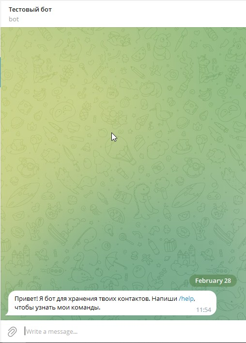
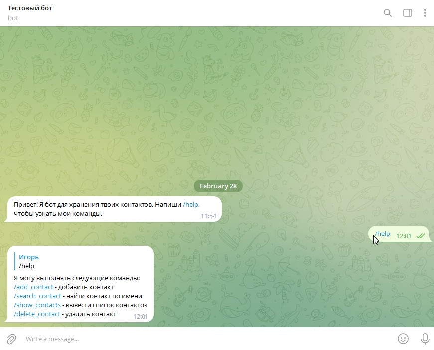
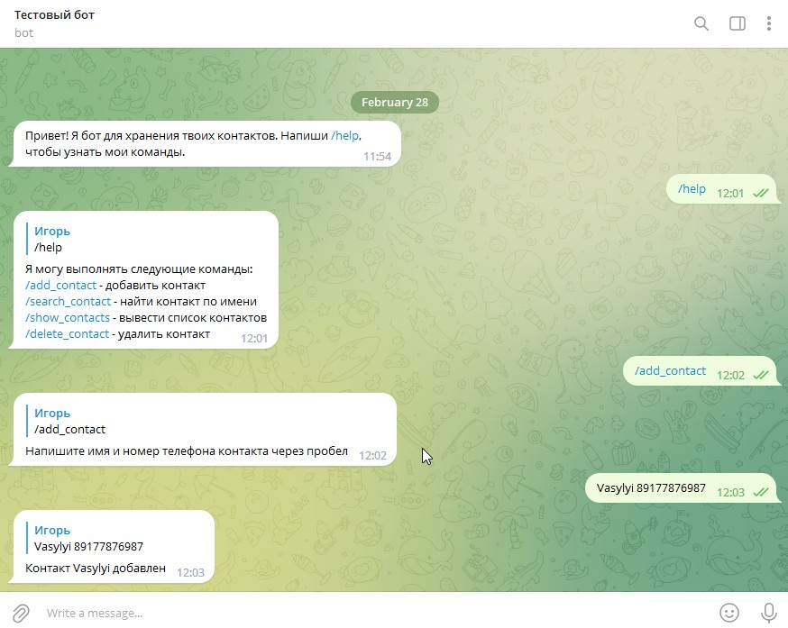
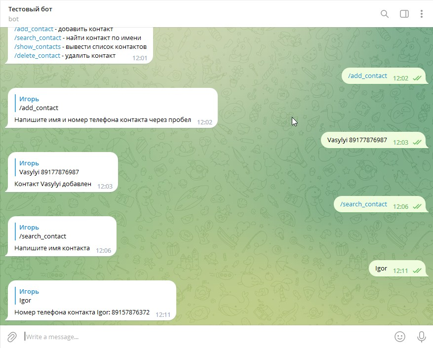
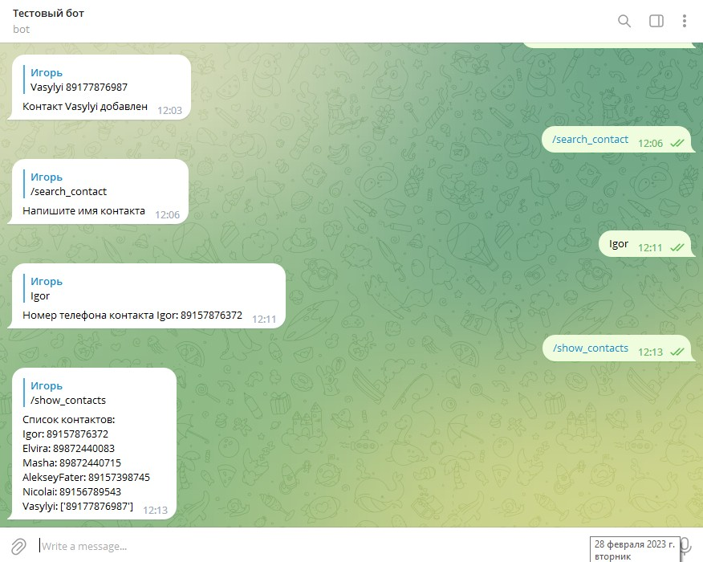
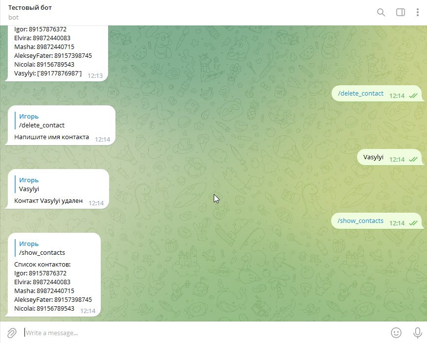
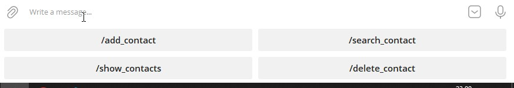

## Описание бота для хранения контактов на Python
Данный бот на языке Python использует библиотеку Telebot для работы с Telegram API и предназначен для хранения и управления списком контактов.

## Функционал
Бот позволяет выполнять следующие команды:

* /start - начало работы с ботом;
* /help - вывод списка команд;
* /add_contact - добавление нового контакта;
* /search_contact - поиск контакта по имени;
* /show_contacts - вывод списка всех контактов;
* /delete_contact - удаление контакта.

## Работа бота
При запуске бот загружает список контактов из файла **_contacts.json_** и начинает обрабатывать события.

При выполнении команды **_/start_** бот отправляет приветственное сообщение.

При выполнении команды /help бот отправляет сообщение со списком доступных команд.

При выполнении команды /add_contact бот запрашивает у пользователя имя и номер телефона контакта и добавляет их в список контактов. Список контактов записывается в файл contacts.json.

При выполнении команды /search_contact бот запрашивает у пользователя имя контакта и выводит его номер телефона, если контакт найден.

При выполнении команды /show_contacts бот выводит список всех контактов, которые были добавлены пользователем.

При выполнении команды /delete_contact бот запрашивает у пользователя имя контакта и удаляет его из списка контактов. Измененный список контактов записывается в файл contacts.json.

## Кнопки вместо ввода команд
Вместо ввода команд вручную у бота появилась возможность нажать на кнопку. После ввода команды
**/start** появляется меню кнопок из четырех команд.

## Требования
### Для работы бота необходимо наличие следующих компонентов:

* Python 3.x;
* Библиотека Telebot;
* Telegram-бот и его токен.

## Установка
1. Установите **Python 3** с официального сайта.
2. Установите библиотеку **Telebot** командой: **pip install pytelegrambotapi**.
3. Создайте нового бота в **Telegram** и получите его токен.
4. Скачайте файл **ram.py** из репозитория.
5. Откройте файл **ram.py** и замените значение переменной **TOKEN** на свой токен.
6. Запустите файл **ram.py**.
### Автор: _IgorAlexP_
### Автор кода: _IgorAlexP_.